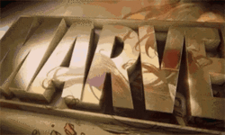

# Marvel Divide 2015

> This is an educational project to make a website for a conference event with home page and about page.

## Built With

- HTML5, CSS3, JavaScript
- Linters:
  - Stylelint
  - Lighthouse
  - Webhint
  - ESLint

## Project Documentation

- Here is the [link]() to my loom video

## Website Mockup 📱 💻 🖥️

## Live Demo

[Capstone I : Marvel Divide 2015]()

## Authors

👤 **John Kpordje**

- GitHub: [@Outkarm](https://github.com/Outkarm)
- Twitter: [@outkarm](https://twitter.com/outkarm)
- LinkedIn: [John Kpordje](https://www.linkedin.com/in/john-kpordje-866749241/)

## 🤝 Contributing

Contributions, issues, and feature requests are welcome!

Feel free to check the [issues page](../../issues/).

## Show your support

Give a ⭐️ if you like this project!

## Acknowledgments

- [Microverse](microverse.org)
- Code Reviewers
- Inspiration:
  - [Mostafa Shahat](https://github.com/MostafaShahat2021)
  - [Umer Zia](https://github.com/UmerZia/Portfolio)
  - [amon-cofie](https://github.com/amon-cofie)

Under the the [Creative Commons liscense](https://creativecommons.org/licenses/by-nc/4.0/)

Original design from [Cindy Shin in Behance](https://www.behance.net/gallery/29845175/CC-Global-Summit-2015)

## 📝 License

This project is [MIT](./MIT.md) licensed.
